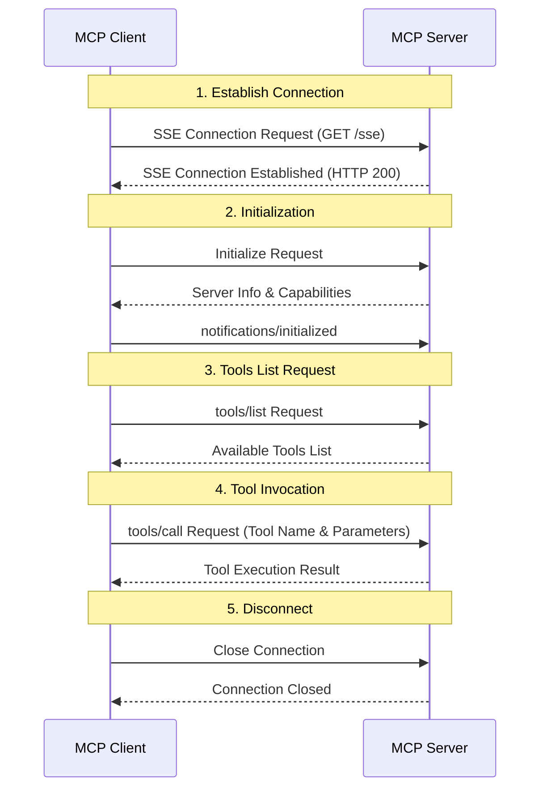

# MCP with Spring

## Project Overview

This project is a Java-based demo designed to understand and test the low-level operations of the Model Context Protocol (MCP). Since most MCP-related examples are currently implemented in Python or TypeScript, this project was developed to explore and experiment with MCP implementations within the Java ecosystem.

## Development Motivation

While frameworks like Quarkus and Spring AI support MCP, I felt there was a lack of understanding about the low-level processing of requests and responses. Specifically, I wanted to gain deeper insights into:

- The message flow of the MCP protocol
- Real-time communication using Server-Sent Events (SSE)
- The internal workings of tool invocation and prompt management

This project was initiated to explore these aspects in depth.

## Project Goals

This project was created to understand the fundamental operations of the MCP protocol and experiment with the internal workings of an MCP server. The development focused on:

- Understanding the basic message flow of the MCP protocol
- Implementing real-time communication using SSE
- Developing core features like tool invocation and prompt management

## Sequence Diagram

The following sequence diagram illustrates the basic connection and communication flow between an MCP client and server:

## Project Status

This project was developed as a demo to understand the basic operations of MCP, and no further development is planned. The main reasons are:

- I've gained sufficient understanding of MCP's core concepts and operations, achieving all the insights I aimed for.
- The current implementation is adequate for testing and understanding MCP's basic operations.
- I believe focusing on other projects would provide greater value than further expanding this codebase.

## Key Features

- Real-time communication using SSE
- Basic MCP protocol message handling
- Tool invocation and management
- Prompt management

## API Endpoints

- GET /sse: Establish SSE connection
- POST /mcp/messages: Process MCP messages
  - initialize: Server initialization
  - tools/list: List available tools
  - tools/call: Invoke a tool
  - Other MCP message processing

## Important Notes

This project was created solely for demonstration and educational purposes and is not suitable for production use.

## License

This project is licensed under the MIT License, which means anyone is free to use, modify, and distribute it. See the LICENSE file for more details.
