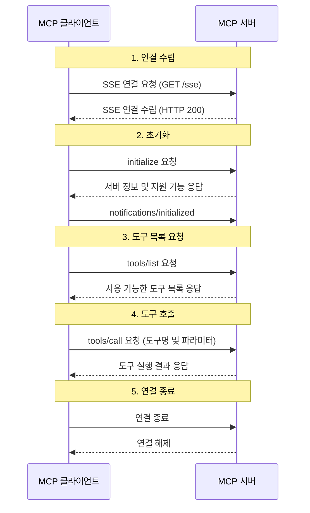

# MCP with Spring

## 프로젝트 소개

이 프로젝트는 Model Context Protocol(MCP)의 로우레벨 동작 방식을 이해하고 테스트하기 위해 제작된 Java 기반 데모 프로젝트입니다. 현재 MCP와 관련된 대부분의 예제가 Python이나 TypeScript로 작성되어 있어, Java 생태계에서의 구현 사례를 직접 실험해보고자 개발하게 되었습니다.

## 개발 동기

Quarkus나 Spring AI와 같은 프레임워크에서 MCP를 지원하고 있지만, 실제로 어떻게 요청과 응답이 처리되는지에 대한 로우레벨의 이해가 부족하다고 느꼈습니다. 특히:

- MCP 프로토콜의 메시지 흐름
- SSE(Server-Sent Events)를 활용한 실시간 통신
- 도구 호출 및 프롬프트 관리의 내부 동작 방식

에 대한 깊은 이해를 얻기 위해 이 프로젝트를 시작하게 되었습니다.

## 프로젝트 목적

이 프로젝트는 MCP 프로토콜의 기본적인 동작 방식을 이해하고, MCP 서버의 내부 작동 원리를 실험하기 위해 제작되었습니다. 특히 다음 사항들에 중점을 두고 개발되었습니다:

- MCP 프로토콜의 기본 메시지 흐름 이해
- SSE를 활용한 실시간 통신 구현
- 도구 호출 및 프롬프트 관리와 같은 핵심 기능 구현

## 시퀀스 다이어그램

다음은 MCP 클라이언트와 서버 간의 기본적인 연결 및 통신 흐름을 보여주는 시퀀스 다이어그램입니다:

## 프로젝트 상태

이 프로젝트는 MCP의 기본적인 동작 방식을 이해하기 위한 데모 용도로 제작되었으며, 더 이상의 개발이 계획되어 있지 않습니다. 주요 이유는 다음과 같습니다:

1. MCP 프로토콜의 핵심 개념과 동작 방식을 충분히 이해했으며, 이를 통해 얻고자 했던 인사이트를 모두 얻었습니다.
2. 현재 구현으로도 MCP의 기본적인 동작 방식을 테스트하고 이해하는 데는 충분한 수준입니다.
3. 추가적인 기능 확장 및 코드 개선보다는 다른 프로젝트에 집중하는 것이 더 큰 가치가 있다고 판단했습니다.

## 주요 기능

- SSE 기반 실시간 통신
- MCP 프로토콜 기본 메시지 처리
- 도구 호출 및 관리
- 프롬프트 관리

## API 엔드포인트

- `GET /sse`: SSE 연결 수립
- `POST /mcp/messages`: MCP 메시지 처리
  - `initialize`: 서버 초기화
  - `tools/list`: 도구 목록 조회
  - `tools/call`: 도구 호출
  - 기타 MCP 메시지 처리

## 주의사항

이 프로젝트는 데모 및 학습 용도로만 제작되었으며, 프로덕션 환경에서 사용하기에는 부족합니다.

## 라이선스

이 프로젝트는 [MIT 라이선스](LICENSE)를 따릅니다. 이는 누구나 자유롭게 사용, 수정, 배포할 수 있음을 의미합니다. 자세한 내용은 [LICENSE](LICENSE) 파일을 참조하세요.